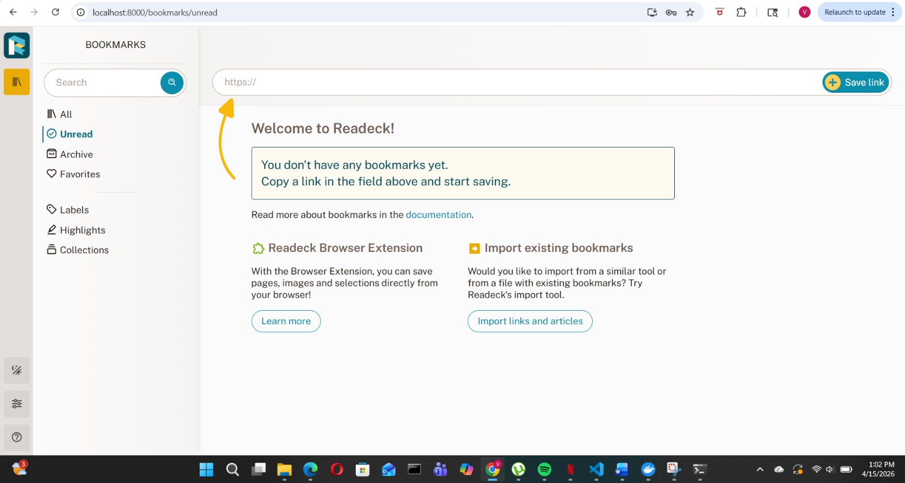
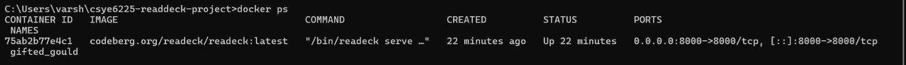

# csye6225-readdeck-project
cloud project
# CSYE6225 Optional Project - Readeck

## Project Overview
This project demonstrates the local and cloud deployment of Readeck, a self-hosted read-it-later web application, using Docker.

## Business Goal
The goal of this project is to provide users with a platform to save, organize, and read web content later.

## Target Users
Students, researchers, and professionals who want to manage useful online articles and reading materials.

## Tech Stack
- Readeck
- Docker
- GitHub
- AWS EC2

## License
MIT License

## Local Setup
Run the application locally with:


```bash
docker run -d -p 8000:8000 codeberg.org/readeck/readeck:latest


## Screenshots

## Dashboard


## Docker Running


## Login Page
